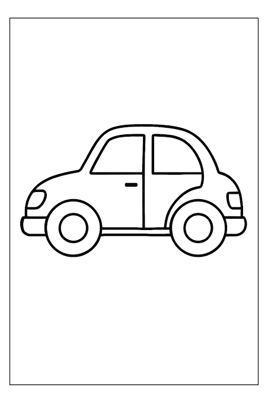

# TDE 2: Código Morse e Flood Fill

Trabalho da disciplina Resolução de Problemas Estruturados em Computação (PUCPR). São duas aplicações em Java, cada uma com o seu próprio menu:

- **Código Morse** (`Morse/`): decodifica Morse usando uma árvore binária.
- **Flood Fill** (`Floodfill/`): balde de tinta em duas versões, uma com fila e outra com pilha, as duas implementadas pela equipe.

## Requisitos

- JDK 18 ou mais novo (testado com o JDK 21). Os fontes estão em UTF-8, que só é o padrão do Java a partir do JDK 18.
- Ambiente gráfico: o Flood Fill abre uma janela, e o Morse abre um seletor para escolher o arquivo.
- Nenhuma biblioteca externa.

## Estrutura

```
Main.java          Menu geral, que abre um dos dois projetos
Morse/             Código Morse (Main.java e o arquivo de teste)
Floodfill/
  Main.java        Abre o editor do Flood Fill
  GerarGif.java    Junta as etapas salvas num GIF
  comum/           Janela, etapas em imagem e classes usadas pelas duas versões
  fila/            Versão com fila
  pilha/           Versão com pilha
```

## Como compilar e executar

### Menu geral

Na raiz do repositório:

```
java Main.java
```

O menu compila o projeto escolhido e abre o menu dele. Ao sair do projeto, volta para o menu geral.

### Cada projeto separado

Código Morse:

```
cd Morse
javac Main.java
java Main
```

Flood Fill:

```
cd Floodfill
javac Main.java
java Main
```

## Código Morse

| Opção | O que faz |
|---|---|
| 1 | Decodifica o Morse digitado |
| 2 | Decodifica um arquivo `.txt`, escolhido numa janela |
| 3 | Mostra a árvore binária |
| 0 | Sai |

A entrada é uma linha só, com `.`, `-`, espaço e `/`. Um espaço separa as letras e a barra separa as palavras.

```
Entrada: --- .-.. .- / -- ..- -. -.. ---
Saída:   OLA MUNDO
```

- **Arquivo de teste:** `Morse/arquivo.txt` decodifica para `TESTANDO AQUI`.
- **Entradas inválidas:** qualquer outro caractere faz a entrada ser recusada. Uma sequência que sai da árvore, como `......`, gera um aviso e é descartada. Arquivo inexistente e opção inválida do menu também mostram mensagem de erro.
- **Árvore:** a classe `ArvoreBinaria` monta a árvore com uma chamada de `inserir` para cada letra (A a Z) e cada número (0 a 9). Ponto leva ao filho da esquerda e traço ao filho da direita.
- **Diagrama:** a árvore é desenhada deitada, com a raiz à esquerda. Os traços sobem e os pontos descem.
- **Codificação:** a parte de codificar texto para Morse, tratada como opcional pelo professor, não foi implementada.

## Flood Fill

As duas versões pintando a mesma imagem (`Floodfill/TesteCarro.png`). A fila preenche em camadas a partir do pixel clicado, e a pilha avança por caminhos compridos. A região pintada no final é a mesma.

| Fila | Pilha |
|:---:|:---:|
|  |  |

### Como usar

1. Clique em **Abrir imagem...** para escolher uma imagem (BMP, PNG, JPG ou GIF), ou desenhe na grade com o **Lapis**.
2. Escolha a cor nova na paleta ou em **Mais cores...**.
3. Clique em **Balde (Fila)** ou **Balde (Pilha)**.
4. Clique no pixel inicial.

O preenchimento é animado na tela, e dá para repetir quantas vezes quiser sem reiniciar o programa.

O menu do enunciado corresponde a estes controles da janela:

| Menu do enunciado | No editor |
|---|---|
| 1 - Executar com pilha | Botão **Balde (Pilha)** e clique na imagem |
| 2 - Executar com fila | Botão **Balde (Fila)** e clique na imagem |
| 3 - Escolher imagem | Botão **Abrir imagem...** |
| 4 - Escolher coordenada de início | Clique no pixel (o X e o Y do pixel sob o mouse aparecem no canto inferior direito) |
| 0 - Encerrar | Fechar a janela |

Outros controles:

- **Limiar** (0 a 255): quanto a cor de um pixel pode diferir da cor do pixel clicado e ainda ser pintada. Começa em 50. Com 0, só a cor exatamente igual é pintada, como descreve o enunciado.
- **Atraso por passo (ms):** velocidade da animação.
- **Cancelar:** para o preenchimento em andamento e devolve a imagem como estava antes.
- **Salvar imagem...:** grava a imagem atual em PNG ou BMP.
- **Labirinto infinito...:** gera labirintos e resolve cada um com o Flood Fill escolhido.

### Etapas em imagem

Com **Salvar etapas em BMP** marcado, cada preenchimento grava `passo_0000.bmp`, `passo_0001.bmp` e assim por diante na pasta `saida_fila` ou `saida_pilha`, criada onde o programa foi executado. A primeira imagem de cada preenchimento é a imagem antes de pintar, e a última é a imagem final.

- **Acúmulo:** um novo preenchimento continua a numeração do anterior. O botão **Resetar BMPs** apaga as etapas e volta ao `passo_0000`.
- **Imagens grandes:** aumente o valor de "a cada N pixels". Cada BMP tem o tamanho da imagem inteira, e com o valor inicial (10) uma imagem grande gera milhares de arquivos.

### Gerar GIF das etapas

Na pasta `Floodfill`:

```
javac GerarGif.java
java GerarGif
```

Cada pasta `saida_*` vira um GIF com o mesmo nome, como `saida_fila.gif`. Também dá para escolher a pasta, o tempo por quadro em milissegundos e o máximo de quadros:

```
java GerarGif saida_fila 30 500
```

### Como funciona

- `comum/Position.java` guarda a linha e a coluna de um pixel.
- `fila/FloodFillFila.java` tem a fila própria (`Node` e `Queue`), e `pilha/FloodFillPilha.java` tem a pilha própria (`Node` e `Stack`). As duas são listas encadeadas e não usam `Stack`, `Queue` nem `Deque` do Java.
- O laço é iterativo: tira uma posição da estrutura, ignora se ela estiver fora da imagem ou se a cor não for a da região, pinta o pixel e insere os quatro vizinhos (cima, baixo, esquerda e direita).
- A troca de cor serve de marca de visitado. Se a cor nova for igual à original, o algoritmo encerra antes de começar.
- `comum/ImageService.java` cuida da animação e das etapas em BMP, e `comum/EditorGrid.java` é a janela.

## Arquivos de teste

- `Morse/arquivo.txt`: uma linha de Morse para a opção 2.
- `Floodfill/ImagemTeste.png`: imagem pequena, de 32×32 pixels.
- `Floodfill/TesteCarro.png`: desenho usado nos GIFs acima.

## Referências

- Enunciado do TDE 2.